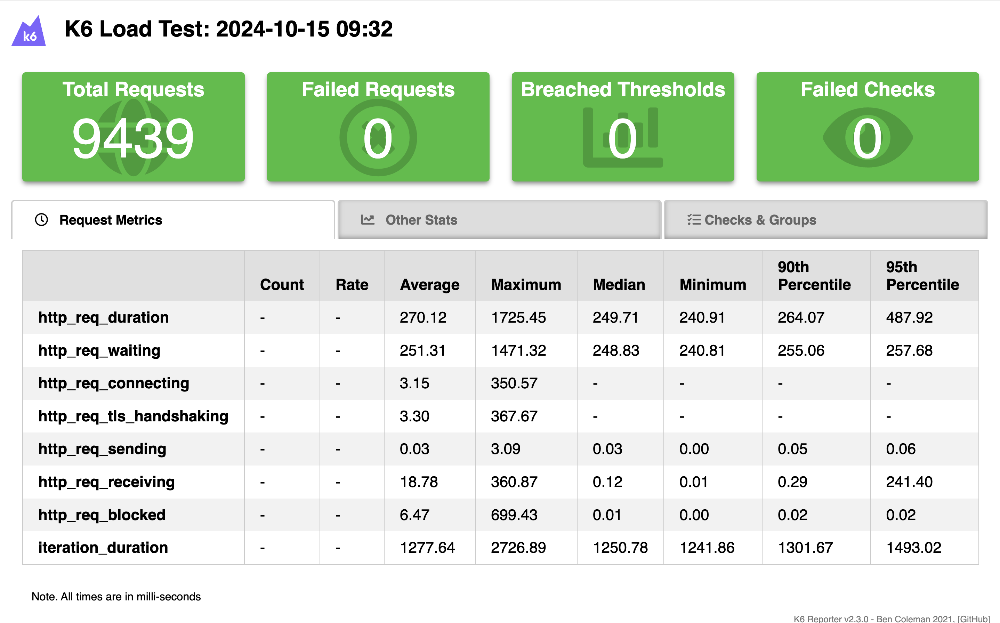

# K6=performance-test
Performance testing using K6\
https://reqres.in/api/users  - get, post

## How to run:
* git clone https://github.com/nadiarizki/sanbercode-supertest-api-automation
* Open folder on Vscode
* run command "k6 run html_report.js"
* right click on report.html and click open in default browser

## Sample report

